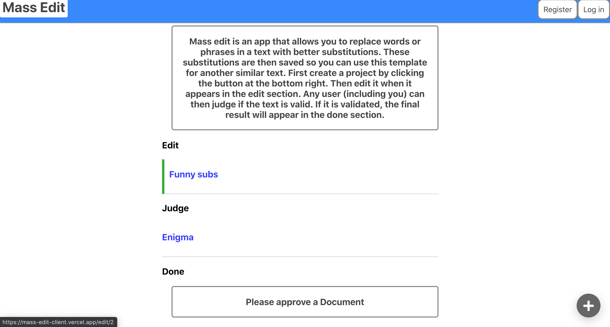

# Mass Edit
Mass edit is an app that allows you to 
replace words or phrases in a text with better substitutions.
These substitutions are then saved so you can use this template
for another similar text. Possible applications are: mass translations, decoding, and any time the user is repeatedly replacing the same set of words.

[Go to the app](https://mass-edit-client.vercel.app/)

## Available Scripts

In the project directory, you can run:

### `npm start`

Runs the app in the development mode. 
Open [http://localhost:3000](http://localhost:3000) to view it in the browser.

The page will reload if you make edits. 
You will also see any lint errors in the console.

### `npm test`

Launches the test runner in the interactive watch mode. 
See the section about [running tests](https://facebook.github.io/create-react-app/docs/running-tests) for more information.

### `npm run build`

Builds the app for production to the `build` folder. 
It correctly bundles React in production mode and optimizes the build for the best performance.

The build is minified and the filenames include the hashes. 
Your app is ready to be deployed!
